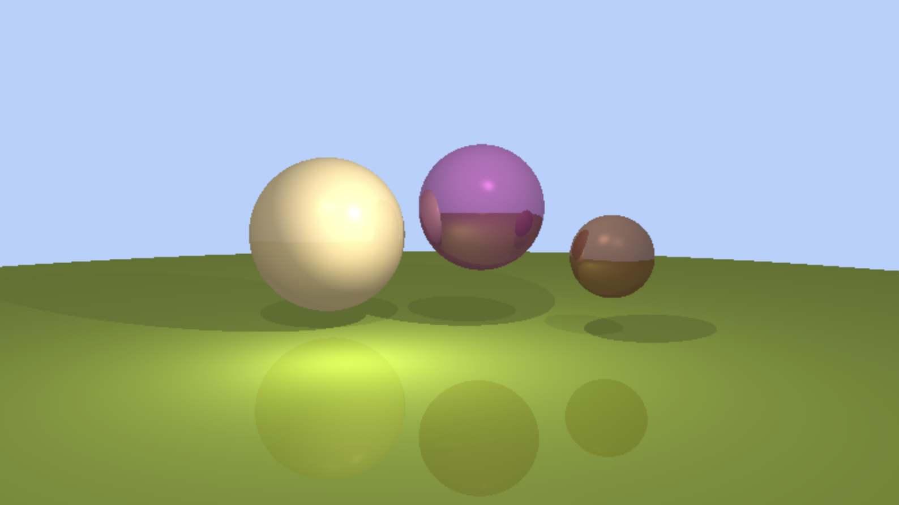

# GPU RayTracing in JavaScript

[DEMO](https://jon111rock.github.io/raytracer-gpu-js/)


## 專案簡介

這是一個使用 React 和 GPU.js 實作的網頁版 GPU 加速光線追蹤器。它可以在瀏覽器中即時渲染包含多個球體、不同類型光源、陰影和反射效果的 3D 場景。使用者可以透過控制面板即時調整攝影機參數和部分球體的屬性。

演算法基礎概念參考了 [Ray Tracing in One Weekend](https://raytracing.github.io/books/RayTracingInOneWeekend.html)。

## 主要功能

*   **GPU 加速渲染**: 利用 GPU.js 將光線追蹤計算在 GPU 上並行處理，提高渲染效能。
*   **互動式控制面板**:
    *   調整攝影機位置 (`lookFrom`)、觀察點 (`lookAt`) 和視野角度 (`fov`)。
    *   修改場景中三個主要球體的位置、顏色、半徑、光澤度 (`shine`) 和反射率 (`reflectivity`)。
*   **基本光線追蹤效果**:
    *   光線與球體交點計算。
    *   多光源處理 (環境光、點光源、方向光)。
    *   Phong 光照模型 (漫反射、鏡面反射)。
    *   陰影計算 (硬陰影)。
    *   單層反射。
*   **簡單動畫**: 中間的球體會自動上下移動。

## 技術棧

*   **前端框架**: [React](https://reactjs.org/) (v18)
*   **GPU 計算**: [GPU.js](https://gpu.rocks/) (v2.15.2 - 原始碼嵌入)
*   **狀態/事件管理**: [PubSub.js](https://github.com/mroderick/PubSubJS)
*   **打包工具**: [Webpack](https://webpack.js.org/) (v5)
*   **JavaScript 編譯**: [Babel](https://babeljs.io/)
*   **樣式**: CSS

## 專案結構

```
raytracer-gpu-js/
├── public/             # HTML 模板
├── src/                # 原始碼目錄
│   ├── components/     # React 元件
│   │   ├── Panel/      # 控制面板 UI (CameraPanel, SpherePanel)
│   │   └── Renderer/   # 光線追蹤渲染器核心
│   │       ├── Objects/  # 場景物件定義 (Camera, Lights, Spheres)
│   │       └── modules/  # 依賴模組 (gpu.js, vec3.js)
│   ├── App.jsx         # 頂層應用程式元件
│   ├── App.css         # 頂層樣式
│   ├── event-types.js  # PubSub 事件名稱
│   └── index.js        # 應用程式進入點
├── .gitignore          # Git 忽略配置
├── package.json        # 專案依賴與腳本
├── README.md           # 專案說明文件 (就是你現在看的這個)
└── webpack.config.js   # Webpack 設定檔
```

## 設定與執行

1.  **Clone 專案**:
    ```bash
    git clone https://github.com/jon111rock/raytracer-gpu-js.git
    cd raytracer-gpu-js
    ```
2.  **安裝依賴**:
    ```bash
    npm install
    ```
3.  **啟動開發伺服器**:
    ```bash
    npm start
    ```
    應用程式將會在 `http://localhost:8080` (或另一個可用埠號) 上執行。

4.  **建置生產版本**:
    ```bash
    npm run build
    ```
    建置後的靜態檔案會輸出到 `docs/` 目錄。

## 運作方式

1.  React UI (`Panel`) 元件提供輸入欄位讓使用者修改參數。
2.  當參數改變時，對應的 Panel 元件 (`SpherePanel` 或 `CameraPanel`) 更新其內部 state，並透過 `PubSub.js` 發布 `UPDATE_OBJECT` 或 `UPDATE_CAMERA` 事件，附帶更新後的數據。
3.  `Renderer` 元件訂閱這些事件。接收到事件後，更新其內部儲存的場景數據 (`spheres` 或 `camera` 陣列/物件)。
4.  `Renderer` 元件呼叫 `GPU.js` 建立的 Kernel 函式 (`render`)，並將**整個**更新後的場景數據 (包含所有球體、光源和攝影機參數) 傳遞給 GPU。
5.  GPU 為畫布上的每個像素並行執行 Kernel 中的光線追蹤演算法，計算最終顏色。
6.  計算結果被繪製到由 `GPU.js` 管理的 Canvas 元素上，該元素被添加到 `Renderer` 元件渲染的 `<div>` 中。
